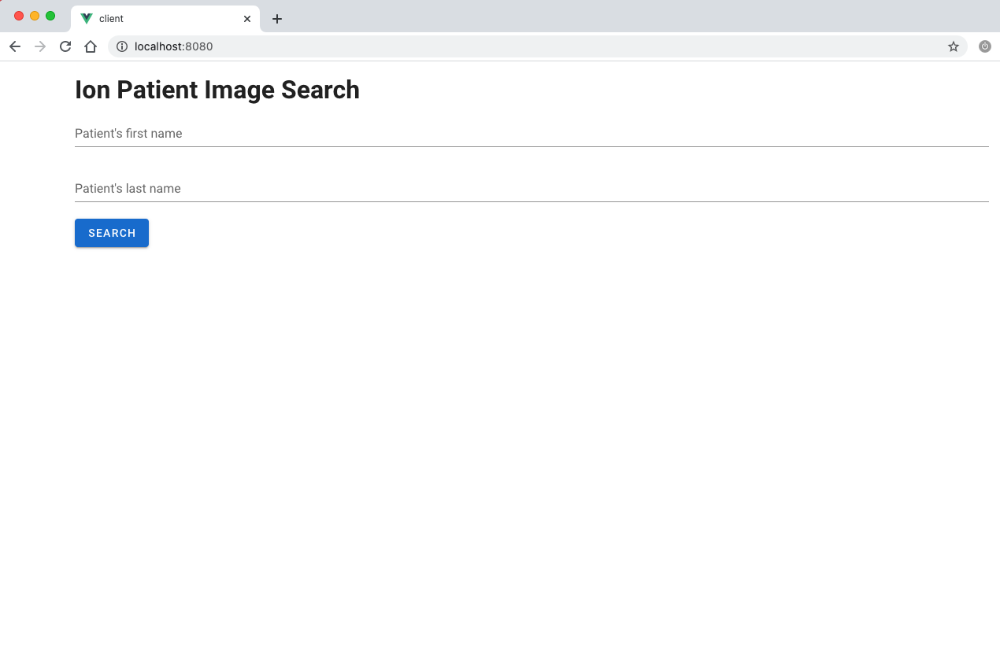

# ImageServer
A prototype server and client that allow a user to search and retrieve medical images from a central storage location.

## Setup
### Client

In the Client/client directory, run the following shell instructions.
```
npm install
```
Compiles and hot-reloads for development
```
npm run serve
```
Open http://localhost:8080/ on browser to access the Client page.

You should see something like this:


## System Components

1. Client (Vue.js)
2. Server (Flask)
3. Database (MySql on AWS RDS)
4. Data Storage (AWS S3)

## System Design Characteristic

1. High Avaliability- ideally -> use AWS to ensure avlaiblity features
2. Security - ideally. sensitive data. maybe use JWT as authentication to access the platform, use Https for security, end to end encrpted, in future

Why it is Restful:
Stateless:  Not using storing any data on server.

Should've done:

1. Sanitize the user input to prevent sql injection attacks.
2. More API endpoints and better naming.
3. Dockerization for easy deployment
4. Unit Testing
5. Kubernetes. Deploy image with certain number of Replicas

Use cases for real hosipital:
1. Authetication
2. Advanced Searching mechanism: sorting based on appointment, designated docter
3. Feature of Adding comment, grouping of images, labels
4. Config high avaliablity for sql on AWS: replication; more read databases
